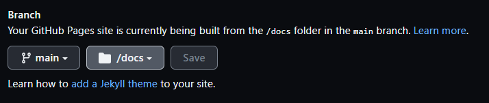

# vue-todolist
VuejsでTODOリストを作成する

## Vueプロジェクト作成
```bash
# VueCliインストール
$ npm install -g @vue/cli

# Vueプロジェクトを作成
$ vue create todo-list

# 下記を選択する
❯ Default ([Vue 3] babel, eslint)

# プロジェクト作成完了後
「./todo-list/src」に「./src」の中身をコピーする

# Vueプロジェクト起動
$ cd todo-list
$ npm run serve
```

## ブラウザからのアクセス方法
```js
http://[ホストPCのipアドレス]:8080
```
## GitHub Pagesに公開
`vue.config.js`を修正
```js
module.exports = {
  outputDir: 'docs',
  publicPath: './'
}
```
ビルドで`docs`に生成
```bash
$ npm run serve
```
GitHubにアップしたら、SettingsのPagesでbranchはmain、folderはdocsを選んで保存


## GitHub Pagesの下記URLで公開
https://takanori-azegami-jp.github.io/vue-todolist/

## 参考サイト
- [Docker+VuejsでTODOリストを作る](https://alterbo.jp/blog/ryu5-2106/)
- [Vue.jsでTodoアプリを作ってみよう](https://note.com/kenpapa/n/n948005f6da63)
- [VueプロジェクトをGitHub Pagesに公開](https://qiita.com/sindicum/items/f867db9de54630464fea)
